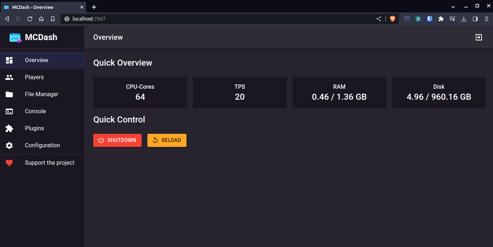

<h1 align="center"> MCDash</h1>

A modern, beautiful web dashboard for managing your Minecraft server

  
  
  
  
  

  <a href="https://mcdash.gnm.dev">📖 Documentation</a> · 
  <a href="https://github.com/gnmyt/MCDash/issues/new?template=bug_report.md">🐛 Report Bug</a> · 
  <a href="https://github.com/gnmyt/MCDash/issues/new?template=feature_request.md">✨ Request Feature</a>

---

## Features

MCDash provides everything you need to manage your Minecraft server from a sleek, modern web interface:

| Feature | Description |
|---------|-------------|
| **Dashboard** | Real-time server status, player count, memory usage, and TPS monitoring |
| **Player Management** | View online players, manage whitelist, and moderate your community |
| **File Manager** | Browse, edit, upload, and manage server files directly in your browser |
| **Console** | Full server console access with command execution |
| **World Management** | Manage multiple worlds, change settings, and organize your server |
| **Plugin Manager** | Install, update, and manage plugins with SpigotMC integration |
| **Backups** | Create and restore server backups with scheduling support |
| **Schedules** | Automate tasks with daily, weekly, or monthly schedules |
| **Configuration** | Edit server.properties and other configuration files easily |

## Screenshots

  <table>
    <tr>
      <td align="center">
        
         <strong>Dashboard</strong>
      </td>
      <td align="center">
        
         <strong>Players</strong>
      </td>
    </tr>
    <tr>
      <td align="center">
        
         <strong>File Manager</strong>
      </td>
      <td align="center">
        
         <strong>Console</strong>
      </td>
    </tr>
    <tr>
      <td align="center">
        
         <strong>Plugins</strong>
      </td>
      <td align="center">
        
         <strong>Backups</strong>
      </td>
    </tr>
  </table>

## Quick Start

### Requirements

- Java 17 or higher
- A Minecraft server (Spigot, Paper, Fabric, or Vanilla)

### Installation

1. **Download** the latest release from the [releases page](https://github.com/gnmyt/MCDash/releases/latest)

2. **Install** the plugin/mod on your server:
   - **Spigot/Paper**: Place the `.jar` file in the `plugins` folder
   - **Fabric**: Place the `.jar` file in the `mods` folder
   - **Vanilla**: Run the standalone `.jar` file

3. **Start** your server and access the dashboard at `http://localhost:7867`

4. **Login** with the credentials shown in the console on first start

For detailed installation instructions, check out our [documentation](https://mcdash.gnm.dev/getting-started/introduction).

## Tech Stack

- **Frontend**: React, TypeScript, Vite, Tailwind CSS, shadcn/ui
- **Backend**: Java, integrated with Minecraft server APIs
- **Supported Platforms**: Spigot, Paper, Fabric, Vanilla

## Contributing

Contributions are welcome! Feel free to:

1. Fork the repository
2. Create a feature branch (`git checkout -b feature/amazing-feature`)
3. Commit your changes (`git commit -m 'Add amazing feature'`)
4. Push to the branch (`git push origin feature/amazing-feature`)
5. Open a Pull Request

## License

This project is licensed under the MIT License - see the [LICENSE](LICENSE) file for details.

---

  Built with ❤️ by <a href="https://gnm.dev">GNM</a> and contributors

